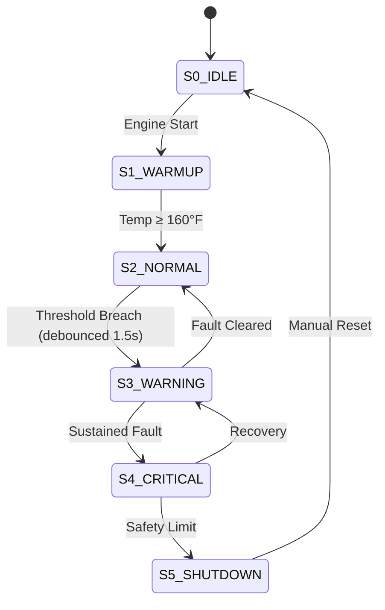

<p align="center">
  <h1 align="center">🔧 YSMAI — Yanmar Smart Maintenance AI</h1>
  <p align="center">
    <strong>Real-Time Predictive Maintenance System for Industrial Diesel Engines</strong>
  </p>
  <p align="center">
    <em>An intelligent agent that monitors engine telemetry, predicts failures using ML, and autonomously schedules maintenance — built with physics-based simulation, a 6-state FSM, and Yanmar diagnostic codes.</em>
  </p>
  <p align="center">
    
    
    
    
    
    
  </p>
</p>

---

## 📋 Table of Contents

- [Overview](#-overview)
- [Key Features](#-key-features)
- [System Architecture](#-system-architecture)
- [ML Pipeline](#-ml-pipeline)
- [Intelligent Agent (FSM)](#-intelligent-agent-fsm)
- [REST API](#-rest-api)
- [Tech Stack](#-tech-stack)
- [Project Structure](#-project-structure)
- [Getting Started](#-getting-started)
- [Testing](#-testing)
- [Author](#-author)

---

## 🧠 Overview

**YSMAI** is an end-to-end intelligent maintenance system designed for Yanmar TNV-series diesel engines used in agricultural and marine applications. It bridges the gap between traditional reactive maintenance and modern **Predictive Maintenance (PdM)** by combining:

- **Physics-based engine simulation** (thermodynamics, vibration dynamics, hydraulic pressure)
- **Machine Learning models** trained on real Kaggle datasets for fault detection, anomaly scoring, and pressure prediction
- **A 6-state Finite State Machine** with temporal logic and debouncing for rational, noise-tolerant decision-making
- **Yanmar OBD-II Diagnostic Trouble Codes (DTCs)** for domain-specific fault classification (P0217, P0118, P0522, etc.)
- **Remaining Useful Life (RUL) estimation** via drift-rate analysis
- **Auto-checkpoint session management** for long-running analysis without data loss

The system simulates a real-world SCADA dashboard where operators can monitor engine health, inject faults for testing, and observe the AI agent's autonomous decision-making process in real time.

---

## ✨ Key Features

| Feature | Description |
|---------|-------------|
| 🤖 **6-State FSM Agent** | `IDLE → WARMUP → NORMAL → WARNING → CRITICAL → SHUTDOWN` with 1.5s debounce and temporal persistence logic |
| 🔬 **3 ML Models** | Random Forest (fault detection), Isolation Forest (vibration anomaly), Linear Regression (pressure prediction) |
| 📡 **Multi-Sensor Simulation** | Temperature, RPM, oil pressure, vibration, voltage — all physics-correlated |
| 🏷️ **Yanmar DTC Codes** | Maps faults to real OBD-II codes: P0217, P0118, P0117, P0522, P0523, P2263 |
| 📊 **RUL Estimation** | Predicts Remaining Useful Life from temperature drift rate (dT/dt) |
| 📸 **Auto-Checkpointing** | Session snapshots every 600 ticks (~5 min) + on critical events |
| 🎯 **Dynamic Scheduler** | Min-heap priority queue for maintenance task ordering |
| 🧪 **Fault Injection** | Simulate temperature spikes, oil pressure drops, vibration anomalies on demand |
| 📝 **Decision Audit Trail** | Every agent decision (state change, DTC, ML prediction) is logged with metadata |
| 🖥️ **React SCADA Dashboard** | Real-time monitoring UI with Recharts, session management, and scenario testing |
| 🔥 **Firebase Integration** | Optional Firestore persistence for audit logs, alerts, and sessions |

---

## 🏗 System Architecture

```
┌──────────────────────────────────────────────────────────────────────┐
│                        React Frontend (TypeScript)                    │
│   ┌──────────┐ ┌──────────┐ ┌───────────────┐ ┌────────────────┐    │
│   │  SCADA   │ │ ML Panel │ │ Scenario Test │ │    Session     │    │
│   │Dashboard │ │          │ │    (A/B)      │ │   Dashboard    │    │
│   └────┬─────┘ └────┬─────┘ └──────┬────────┘ └───────┬────────┘    │
│        └─────────────┴──────────────┴──────────────────┘             │
│                              ↕ REST API (JSON)                       │
├──────────────────────────────────────────────────────────────────────┤
│                      Flask Backend (Python)                           │
│                                                                      │
│   ┌─────────────────────────────────────────────────────────────┐    │
│   │              EnhancedSimulationController                    │    │
│   │                                                              │    │
│   │  ┌──────────────┐ ┌────────────────┐ ┌──────────────────┐   │    │
│   │  │  Simulator    │ │  YSMAI Agent   │ │ Dynamic Scheduler│   │    │
│   │  │  (Physics)    │ │  (6-State FSM) │ │  (Min-Heap)      │   │    │
│   │  │              │ │  + DTC Engine   │ │                  │   │    │
│   │  │  • Temp      │ │  + Drift Detect │ │  • Priority Queue│   │    │
│   │  │  • Pressure  │ │  + RUL Estimate │ │  • Auto-schedule │   │    │
│   │  │  • Vibration │ │  + Debounce     │ │  • Task bumping  │   │    │
│   │  │  • Voltage   │ │                │ │                  │   │    │
│   │  └──────┬───────┘ └───────┬────────┘ └────────┬─────────┘   │    │
│   │         └─────────────────┼─────────────────────┘            │    │
│   │                           ↓                                  │    │
│   │                    ┌──────────────┐                           │    │
│   │                    │  ML Pipeline │                           │    │
│   │                    │  (sklearn)   │                           │    │
│   │                    └──────────────┘                           │    │
│   └─────────────────────────────────────────────────────────────┘    │
│            ↓                              ↓                          │
│   ┌────────────────┐            ┌──────────────────┐                 │
│   │Decision Tracker│            │ Session Manager  │                 │
│   │  (Audit Log)   │            │(Auto-Checkpoint) │                 │
│   └────────┬───────┘            └────────┬─────────┘                 │
│            └──────────────┬──────────────┘                           │
│                           ↓                                          │
│                    ┌──────────────┐                                   │
│                    │   Firebase   │  (Optional)                       │
│                    │  Firestore   │                                   │
│                    └──────────────┘                                   │
└──────────────────────────────────────────────────────────────────────┘
```

---

## 🔬 ML Pipeline

Three scikit-learn models are trained on real-world Kaggle datasets with synthetic fallback:

| Model | Algorithm | Dataset | Purpose | Metric |
|-------|-----------|---------|---------|--------|
| **Fault Detector** | Random Forest Classifier | [Engine Fault Detection](https://www.kaggle.com/datasets/ziya07/engine-fault-detection-data) | Classify engine condition from multi-sensor input | Accuracy |
| **Vibration Anomaly** | Isolation Forest | [NASA Bearing Dataset](https://www.kaggle.com/datasets/vinayak123tyagi/bearing-dataset) | Detect structural anomalies from vibration signals | Anomaly Rate |
| **Pressure Predictor** | Linear Regression | [Hydraulic Systems Monitoring](https://www.kaggle.com/datasets/jjacostupa/condition-monitoring-of-hydraulic-systems) | Predict expected pressure → detect leaks via residual | R² / RMSE |

**Training Pipeline:**
```bash
# Train models on real Kaggle data (auto-falls back to synthetic if Kaggle unavailable)
python students/Train/train_models.py
```

Models are regenerated at runtime — **no binary artifacts are committed** to the repository.

---

## 🤖 Intelligent Agent (FSM)

The core agent implements a **6-state Finite State Machine** with temporal logic:



**Diagnostic Trouble Codes mapped to Yanmar OBD-II standards:**

| DTC Code | Condition | Trigger |
|----------|-----------|---------|
| `P0217` | Engine Coolant Over Temperature | Temp > 226°F (108°C) |
| `P0118` | Coolant Temp Circuit High | Temp > 250°F (121°C) |
| `P0117` | Coolant Temp Circuit Low | Temp < 50°F (10°C) |
| `P0522` | Oil Pressure Sensor Low | Pressure < 10 PSI |
| `P0523` | Oil Pressure Sensor High | Pressure > 75 PSI |
| `P2263` | Excessive Vibration | Vibration > 28 mm/s (ISO 10816-6) |

---

## 🌐 REST API

The Flask backend exposes **15+ endpoints** for frontend integration:

| Method | Endpoint | Description |
|--------|----------|-------------|
| `GET` | `/tick` | Get next simulation tick with all sensor data |
| `GET` | `/health` | Server health check |
| `POST` | `/reset` | Reset simulation to initial state |
| `POST` | `/fault` | Enable/disable fault injection |
| `GET` | `/decisions` | Query agent decision log (filterable) |
| `GET` | `/report` | Generate comprehensive system report |
| `GET` | `/report/download` | Download report as JSON |
| `GET` | `/audit` | Firebase audit log |
| `GET` | `/alerts` | Recent alerts |
| `GET` | `/sessions/current` | Active session with checkpoints |
| `GET` | `/sessions/history` | Past session list |
| `POST` | `/sessions/checkpoint` | Manual checkpoint creation |
| `POST` | `/sessions/end` | End session and archive |
| `GET` | `/sessions/<id>/summary` | Session summary |
| `POST` | `/sessions/compare` | Multi-session comparison |
| `POST` | `/test/scenario` | A/B fault scenario testing |

---

## 🛠 Tech Stack

| Layer | Technology |
|-------|-----------|
| **ML / Data Science** | Python, scikit-learn, NumPy, Pandas |
| **Backend API** | Flask, Flask-CORS |
| **Frontend** | React 18, TypeScript, Vite |
| **Styling** | Tailwind CSS, shadcn/ui |
| **Charts** | Recharts |
| **Database** | Firebase Firestore (optional) |
| **Data Source** | Kaggle Hub (real datasets) |

---

## 📁 Project Structure

```
YSMAI-Engine-Monitoring/
│
├── students/
│   ├── Train/                          # Python Backend
│   │   ├── main.py                     # Entry point
│   │   ├── server.py                   # Flask REST API (15+ endpoints)
│   │   ├── controller_enhanced.py      # Main orchestrator
│   │   ├── agent_enhanced.py           # 6-State FSM + DTC engine
│   │   ├── simulator.py               # Physics-based engine simulation
│   │   ├── scheduler_dynamic.py        # Min-heap priority scheduler
│   │   ├── decision_tracker.py         # Decision audit log
│   │   ├── session_manager.py          # Auto-checkpoint sessions
│   │   ├── ml_training.py              # ML training (synthetic)
│   │   ├── ml_training_kaggle.py       # ML training (Kaggle datasets)
│   │   ├── firebase_integration.py     # Firebase Firestore integration
│   │   ├── test_unit.py                # 19 unit tests
│   │   ├── test_integration.py         # 4 integration tests
│   │   ├── test_ml_agent.py            # ML agent tests
│   │   ├── test_ml_kaggle.py           # Kaggle pipeline tests
│   │   └── requirements.txt            # Python dependencies
│   │
│   └── Frontend/                       # React Frontend
│       ├── src/
│       │   ├── components/
│       │   │   ├── scada/              # SCADA dashboard components
│       │   │   ├── MLModelsPanel.tsx    # ML model visualization
│       │   │   ├── ScenarioTester.tsx   # A/B fault testing UI
│       │   │   ├── SessionDashboard.tsx # Session management UI
│       │   │   └── DataAuditPanel.tsx   # Decision audit viewer
│       │   ├── hooks/                  # Custom React hooks
│       │   ├── pages/                  # Page components
│       │   ├── types/                  # TypeScript interfaces
│       │   └── config/                 # App configuration
│       ├── package.json
│       ├── vite.config.ts
│       └── tailwind.config.ts
│
├── .gitignore                          # Professional ML .gitignore
└── README.md
```

---

## 🚀 Getting Started

### Prerequisites

- Python 3.8+
- Node.js 18+ (for frontend)

### Backend Setup

```bash
# Install dependencies
pip install -r students/Train/requirements.txt

# Train ML models (uses Kaggle data if available, synthetic fallback)
python students/Train/train_models.py

# Start the backend server
python students/Train/server.py
# Server runs at http://localhost:8000
```

### Frontend Setup

```bash
cd students/Frontend

# Install dependencies
npm install

# Start the development server
npm run dev
# Frontend runs at http://localhost:5173
```

### Quick Test (Backend Only)

```python
from students.Train.controller_enhanced import EnhancedSimulationController

ctrl = EnhancedSimulationController(initial_temp=60, drift_rate=0.5)

for i in range(100):
    result = ctrl.tick()
    print(f"Tick {i}: Temp={result['temperature']:.1f}°F | "
          f"State={result['state']} | DTCs={result.get('active_dtcs', [])}")
```

---

## 🧪 Testing

```bash
cd students/Train

# Unit tests (19 tests)
python -m unittest test_unit -v

# Integration tests (4 tests)
python -m unittest test_integration -v

# ML agent tests
python -m unittest test_ml_agent -v

# Kaggle pipeline tests
python -m unittest test_ml_kaggle -v
```

---

## 👤 Author

**Rashad** — ML Engineer  
Built as part of the YSMAI (Yanmar Smart Maintenance AI) research project, 2026.

---

<p align="center">
  <sub>Built with ❤️ for predictive maintenance</sub>
</p>
